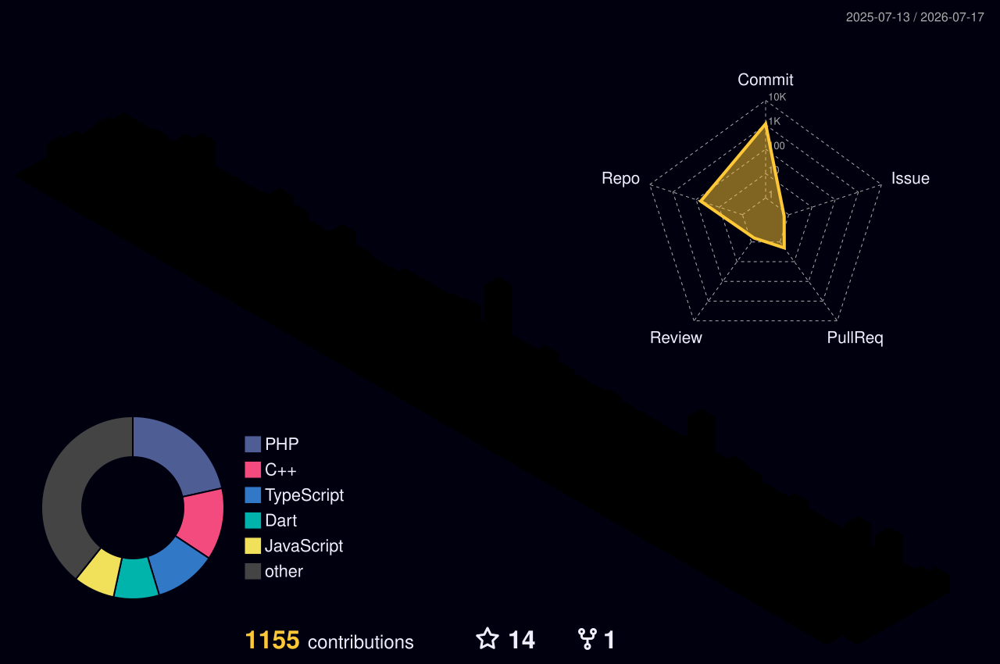

<!-- Typing Animated Banner -->

# 👨‍💻 Anton Prafanto
### **Lecturer · IoT Systems Architect · Full-Stack & AI Engineer · Founder @ Koding Indonesia**

  📍 <i>Samarinda, East Kalimantan, Indonesia (IKN Nusantara Strategic Hub)</i>

---

### 🌟 About Me

I am a university lecturer and academic researcher at the **Informatics Department, Faculty of Engineering, Universitas Mulawarman (UNMUL)**, as well as the founder of **[Koding Indonesia](https://kodingindonesia.com)**. With 10+ years of professional and research experience, I specialize in bridging physical hardware and scalable cloud software:

- 🔬 **Research & Academics:** Supervising software engineering and AI projects, author of 30+ peer-reviewed papers on IoT, sensor telemetry, and applied Machine Learning.
- 📡 **IoT & Embedded Systems:** Architecting real-time telemetry systems, microcontroller firmware (ESP32 / Arduino / LoRa / MQTT), and environmental monitoring gateways.
- 🚀 **Ecosystem Building:** Developing educational platforms, open-source development kits, and digital lab infrastructure supporting the East Kalimantan & Ibu Kota Nusantara (IKN) research ecosystem.

---

### 🚀 Flagship Projects & Platforms

<table>
  <tr>
    <td width="50%" valign="top">
      <h3 align="left">🌐 <a href="https://kodingindonesia.com">Koding Indonesia</a></h3>
      
<b>Platform Belajar Pemrograman & Teknologi Digital</b>

      
Platform edukasi teknologi terdepan untuk developer, mahasiswa, dan praktisi di Indonesia. Menyediakan tutorial praktis, silabus terstruktur, dan artikel mendalam dari embedded systems hingga full-stack web.

      

        
        
        
        
      

      

        🔗 <a href="https://kodingindonesia.com"><b>Kunjungi Website Resmi ➔</b></a> · <a href="https://github.com/antonprafanto/kindo">Repository</a>
      

    </td>
    <td width="50%" valign="top">
      <h3 align="left">📡 <a href="https://iot.kodingindonesia.com">Kindo IoT Samarinda</a></h3>
      
<b>Stasiun & Dashboard Kualitas Udara Real-Time</b>

      
Sistem pemantauan kualitas udara (ISPU, PM2.5, PM10) dan parameter cuaca bergerak berbasis ESP32, sensor laser partikulat, integrasi Telkom Antares oneM2M, GPS breadcrumbs, dan peta spasial interaktif Leaflet.

      

        
        
        
        
      

      

        🔗 <a href="https://iot.kodingindonesia.com"><b>Buka Live Dashboard ➔</b></a> · <a href="https://github.com/antonprafanto/Full-Stack-IoT-Developer">IoT Architecture</a>
      

    </td>
  </tr>
  <tr>
    <td width="50%" valign="top">
      <h3 align="left">🔬 <a href="https://ilab.unmul.ac.id">iLab UNMUL</a></h3>
      
<b>Sistem Informasi Laboratorium Terpadu Universitas Mulawarman</b>

      
Digitalisasi tata kelola sarana riset dan fasilitas laboratorium terpadu bertaraf internasional. Mendukung peminjaman alat, pengujian spesimen, serta transparansi penelitian kawasan penyangga Ibu Kota Nusantara (IKN).

      

        
        
        
      

      

        🔗 <a href="https://ilab.unmul.ac.id"><b>Kunjungi Portal iLab ➔</b></a>
      

    </td>
    <td width="50%" valign="top">
      <h3 align="left">📦 <a href="https://github.com/antonprafanto/bluinoIoTKit_v1">Bluino IoT Kit</a></h3>
      
<b>Modular IoT & Embedded Systems Learning Kit</b>

      
Kit perangkat keras edukasi berbasis ESP32 & Arduino yang dirancang untuk pembelajaran sensor, aktuator, komunikasi serial/I2C/SPI, dan protokol MQTT bagi mahasiswa dan pegiat vokasi di Indonesia.

      

        
        
        
        
      

      

        🔗 <a href="https://github.com/antonprafanto/bluinoIoTKit_v1"><b>Lihat Dokumentasi Kit ➔</b></a>
      

    </td>
  </tr>
  <tr>
    <td width="50%" valign="top">
      <h3 align="left">📄 <a href="https://github.com/antonprafanto/pdfkit">PDFKit</a></h3>
      
<b>Modern Client-Side Document & PDF Suite</b>

      
Kumpulan utilitas pemrosesan dokumen PDF langsung di peramban web modern tanpa perlu mengunggah berkas sensitif ke server luar, cepat, efisien, dan ramah privasi.

      

        
        
        
      

      

        🔗 <a href="https://github.com/antonprafanto/pdfkit"><b>Lihat Repository ➔</b></a>
      

    </td>
    <td width="50%" valign="top">
      <h3 align="left">🤖 <a href="https://scholar.google.com/citations?user=aMovcE0AAAAJ">Applied AI & Machine Learning Lab</a></h3>
      
<b>Model Prediktif, Computer Vision & Logika Fuzzy</b>

      
Implementasi riset kecerdasan buatan terapan: deteksi APD/K3 menggunakan Computer Vision, model peramalan GRU + Attention Mechanism, dan inferensi Sugeno Fuzzy untuk kualitas air peternakan.

      

        
        
        
        
      

      

        🔗 <a href="https://scholar.google.com/citations?user=aMovcE0AAAAJ"><b>Lihat Riset Publikasi ➔</b></a> · <a href="https://github.com/antonprafanto/dasarAI2026">AI Repo</a>
      

    </td>
  </tr>
</table>

---

### 🛠️ Tech Stack & Expertise

| Kategori | Teknologi & Alat |
| :--- | :--- |
| **IoT & Hardware** |       |
| **Languages** |        |
| **Frontend & Mobile** |       |
| **Backend & Database** |       |
| **AI / ML & Research** |       |
| **DevOps & Environment** |      |

---

### 📊 GitHub Activity & 3D Contribution Graph

<picture>
  <source media="(prefers-color-scheme: dark)" srcset="./profile-3d-contrib/profile-night-rainbow.svg">
  <source media="(prefers-color-scheme: light)" srcset="./profile-3d-contrib/profile-green-animate.svg">
  
</picture>

  

  

  
  
  
  

---

### 📚 Selected Research & Publications

> *"Dedicated to bridging academic computing research with real-world technological empowerment."*

- **Prafanto, A. et al. (2025)** — *Sugeno Fuzzy Logic for IoT-based Chicken Farm Drinking Water Quality Monitoring*, Indonesian Journal of Data and Science.
- **Prafanto, A. et al. (2024)** — *Forecasting Stocks Prices with GRU and Attention Mechanism*, International Conference on Electrical Engineering and Informatics.
- **Prafanto, A. et al. (2021)** — *Pendeteksi Kehadiran Menggunakan ESP32 untuk Sistem Pengunci Pintu Otomatis*, JTT – Jurnal Teknologi Terapan. *(27 Citations)*
- **Prafanto, A. et al. (2018)** — *A Water Level Detection: IoT Platform Based on Wireless Sensor Network*, EIConCIT 2018. *(26 Citations)*
- **Prafanto, A. et al. (2022)** — *Pemodelan Konsep Augmented Reality Motif Batik Dayak Kalimantan Timur*, Metik Jurnal.

🔍 **Daftar publikasi lengkap tersedia di [Google Scholar Profile ➔](https://scholar.google.com/citations?user=aMovcE0AAAAJ)**

---

### 🤝 Get in Touch & Collaborate

Tertarik berkolaborasi dalam riset IoT, pengembangan sistem perangkat lunak, program pelatihan kampus/vokasi, atau implementasi smart city di Kalimantan Timur dan kawasan IKN Nusantara?

 
<i>Build · Innovate · Educate — From Embedded Hardware to Scalable Cloud Ecosystems.</i>

